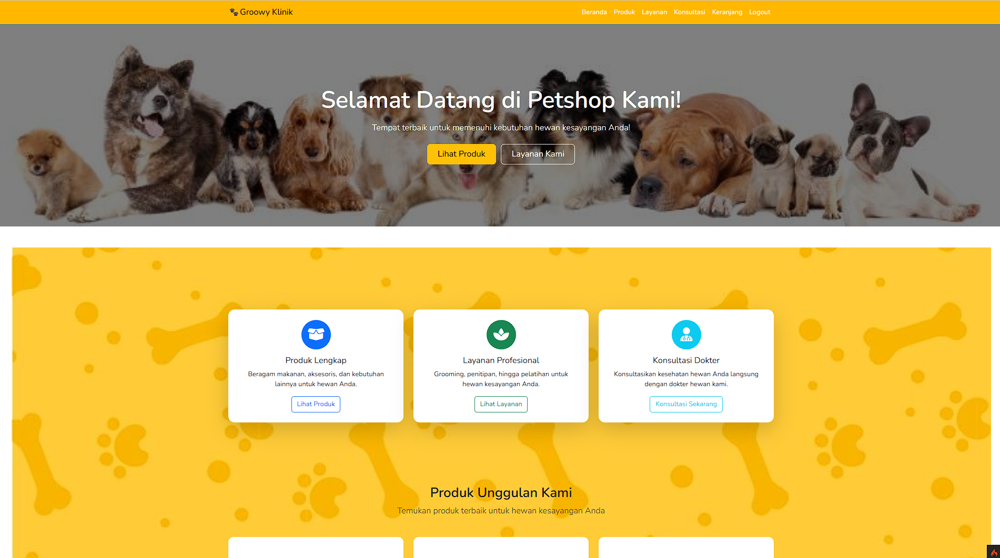

# 🐾 Petshop Management System (CodeIgniter 4)

## 📖 Deskripsi

Aplikasi ini adalah sistem manajemen petshop berbasis **CodeIgniter 4** yang menyediakan fitur untuk **kelola produk, layanan, konsultasi, pesanan, dan pengguna**.
Proyek ini dikembangkan untuk membantu admin maupun pelanggan dalam mengakses informasi petshop secara efisien melalui antarmuka web yang modern dan responsif.

---

## ✨ Fitur Utama

### 👩‍💻 Untuk Admin

* **Dashboard** ringkasan data (produk, layanan, konsultasi, pesanan, pengguna).
* Kelola Produk (CRUD).
* Kelola Layanan.
* Manajemen Konsultasi pelanggan.
* Kelola Pesanan.
* Manajemen Pengguna.

### 🐶 Untuk Pelanggan

* Registrasi & Login.
* Lihat daftar produk.
* Lihat layanan petshop.
* Konsultasi dengan dokter hewan.
* Pesan produk/layanan.
* Manajemen akun & keranjang belanja.

---

## 📸 Tampilan Aplikasi

### Admin Dashboard



### Halaman Utama Pelanggan


---

## 🛠️ Teknologi yang Digunakan

* [CodeIgniter 4](https://codeigniter.com/)
* PHP 7.4+
* MySQL/MariaDB
* Bootstrap 5 / CSS custom
* Font Awesome & Icon Pack

---

## ⚙️ Instalasi & Setup

### 1. Clone Repository

```bash
git clone https://github.com/<username>/petshop-kelompok-4.git
cd petshop-kelompok-4
```

### 2. Install Dependencies

Pastikan **Composer** sudah terinstall. Jalankan:

```bash
composer install
```

### 3. Konfigurasi Environment

Salin file `.env.example` menjadi `.env`:

```bash
cp env .env
```

Edit `.env` sesuai konfigurasi lokal:

```ini
app.baseURL = 'http://localhost:8080/'

database.default.hostname = localhost
database.default.database = petshop
database.default.username = root
database.default.password = 
database.default.DBDriver = MySQLi
```

### 4. Migrasi Database

Jalankan migrasi & seeding data:

```bash
php spark migrate
php spark db:seed DatabaseSeeder
```

### 5. Jalankan Server Development

```bash
php spark serve
```

Akses aplikasi di:
➡️ `http://localhost:8080/`

---

## 📂 Struktur Folder Penting

```
app/            -> Source code utama
public/         -> Root folder untuk akses web
writable/       -> Cache, logs, session, uploads
.env            -> Konfigurasi environment
composer.json   -> Dependency manager
```

---

## 👥 Kontributor

* Ari Rahmat
* Farid2-art
* Tim Kelompok 4

---

## 📜 Lisensi

MIT License – bebas digunakan, dimodifikasi, dan didistribusikan dengan mencantumkan kredit.
